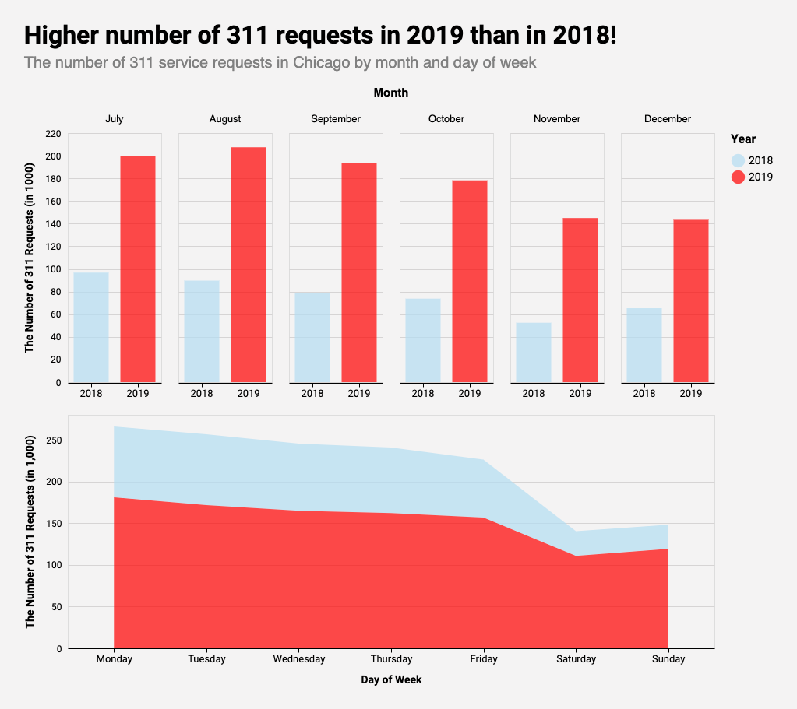

# Exploring 311 Service Requests in Chicago
## By Si Young Byun

## *Motivation*

In 1996, Baltimore deployed 3-1-1 as a dedicated telephone number for
non-emergency queries. Proving to be very popular, the 311 service was made
available to other police departments in the US. In 1999, Chicago launched the
__first comprehensive 311 service__, which not only dealt with non-emergency
police-related queries but also with other non-emergency civic service requests.
Since then, other major US cities such as Los Angeles and New York City also
adopted 311 service.

In late 2018, Chicago launched its new $35 million 311 platform [__CHI 311__](
https://311.chicago.gov/s/?language=en_US), which would allow its residents to
use their phones or computers to log and track their 311 service requests. Since
the launch of the modernized platform, [__Chicago Data Portal__](
https://data.cityofchicago.org/Service-Requests/311-Service-Requests/v6vf-nfxy) 
has been releasing the data for requests created from the new platform as well
as some historical data. 

## *Data Sources*

1. [311 Service Requests](https://data.cityofchicago.org/Service-Requests/311-Service-Requests/v6vf-nfxy): This dataset from Chicago Data Portal includes all 311 service
requests created in Chicago after the launch of the new 311 service as well as
some requests that were created before the launch. Each row represents a service 
request. Although it has 37 columns, the variables that are of interest for the
exploration include:
    - CREATED_DATE,
    - CLOSED_DATE,
    - ZIP_CODE,
    - LONGITUDE & LATITUDE,
    - OWNER_DEPARTMENT,
    - and SR_TYPE. 

2. [US Census Bureau Data](https://www.census.gov/):
From this dataset (American Community Survey 2018 5-Year Estimates),
I was able to get income level and population size for census tracts in Chicago.

3. [Boundaries - Census Tracts - 2010](https://data.cityofchicago.org/Facilities-Geographic-Boundaries/Boundaries-Census-Tracts-2010/5jrd-6zik):
For this portfolio, I used the shapefile of census tracts to join US Census
Bureau data and 311 Service Requests data.

4. [Budget - 2019 Budget Ordinance - Appropriations](https://data.cityofchicago.org/Administration-Finance/Budget-2019-Budget-Ordinance-Appropriations/h9rt-tsn7):
This dataset from Chicago Data Portal includes the final City operating budget as approved by the City Council.

5. [Datasets created by above datasets](https://github.com/siyoungbyun/311-requests-dataviz/tree/master/data): If you are interested in how I preprocessed the data, please visit [this Jupyter Notebook](https://github.com/siyoungbyun/311-requests-dataviz/blob/master/data_preprocessing.ipynb).

## *Comparing the Number of 311 Requests in 2018 and 2019*

 

