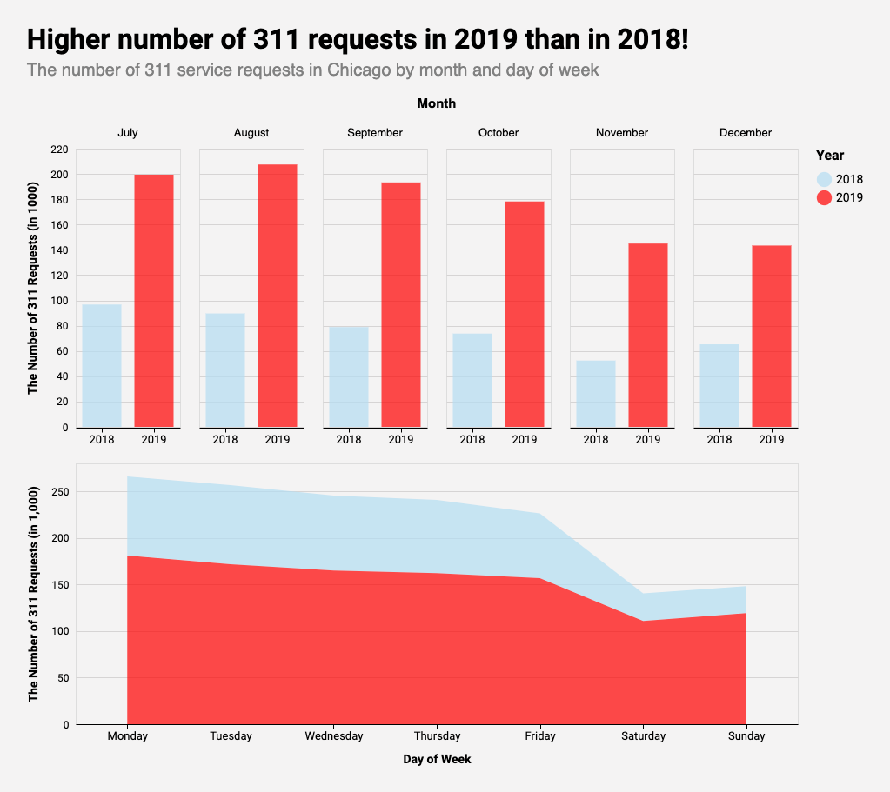
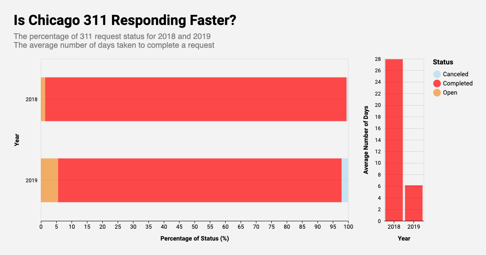
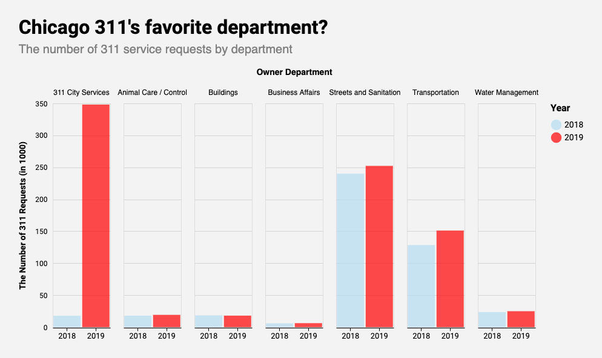

# Exploring 311 Service Requests in Chicago
## By Si Young Byun

## *Motivation*

In 1996, Baltimore deployed 3-1-1 as a dedicated telephone number for
non-emergency queries. Proving to be very popular, the 311 service was made
available to other police departments in the US. In 1999, Chicago launched the
__first comprehensive 311 service__, which not only dealt with non-emergency
police-related queries but also with other non-emergency civic service requests.
Since then, other major US cities such as Los Angeles and New York City also
adopted 311 service.

In late 2018, Chicago launched its new $35 million 311 platform [__CHI 311__](
https://311.chicago.gov/s/?language=en_US), which would allow its residents to
use their phones or computers to log and track their 311 service requests. Since
the launch of the modernized platform, [__Chicago Data Portal__](
https://data.cityofchicago.org/Service-Requests/311-Service-Requests/v6vf-nfxy) 
has been releasing the data for requests created from the new platform as well
as some historical data. 

## *Data Sources*

1. [311 Service Requests](https://data.cityofchicago.org/Service-Requests/311-Service-Requests/v6vf-nfxy): This dataset from Chicago Data Portal includes all 311 service
requests created in Chicago after the launch of the new 311 service as well as
some requests that were created before the launch. Each row represents a service 
request. Although it has 37 columns, the variables that are of interest for the
exploration include:
    - CREATED_DATE,
    - CLOSED_DATE,
    - ZIP_CODE,
    - LONGITUDE & LATITUDE,
    - OWNER_DEPARTMENT,
    - and SR_TYPE. 

2. [US Census Bureau Data](https://www.census.gov/):
From this dataset (American Community Survey 2018 5-Year Estimates),
I was able to get income level and population size for census tracts in Chicago.

3. [Boundaries - Census Tracts - 2010](https://data.cityofchicago.org/Facilities-Geographic-Boundaries/Boundaries-Census-Tracts-2010/5jrd-6zik):
For this portfolio, I used the shapefile of census tracts to join US Census
Bureau data and 311 Service Requests data.

4. [Budget - 2019 Budget Ordinance - Appropriations](https://data.cityofchicago.org/Administration-Finance/Budget-2019-Budget-Ordinance-Appropriations/h9rt-tsn7):
This dataset from Chicago Data Portal includes the final City operating budget as approved by the City Council.

5. [Datasets created by above datasets](https://github.com/siyoungbyun/311-requests-dataviz/tree/master/data): If you are interested in how I preprocessed the data, please visit [this Jupyter Notebook](https://github.com/siyoungbyun/311-requests-dataviz/blob/master/data_preprocessing.ipynb).

## *Comparing the Number of 311 Requests in 2018 and 2019*

One simple way of visualizing the trend of 311 requests *before* and *after* the inception of
the new 311 app would be to compare the overall number of 311 requests in 2018
and 2019, since the new system was deployed near the end of 2018.

Source: [Chicago Data Portal](https://data.cityofchicago.org/Service-Requests/311-Service-Requests/v6vf-nfxy)
 
The number of 311 requests in Chicago clearly increased in 2019 compared to 2018! Of course, this does not *prove* that the new 311 app is successful. However, it does suggest a compelling story that the new 311 app at least improved the accessibility of the 311 service. It is also interesting to find that people are less likely to file service requests during weekends and winter season.

__*note*__: This chart only shows the data from July to December. This is *not* some malicious data manipulation but simply due to how the original dataset was structured. For some unspecified reason, the dataset starts from July 2018. For direct comparison between the two years, I decided to only show the data from July to December for 2019 as well.

Source: [Chicago Data Portal](https://data.cityofchicago.org/Service-Requests/311-Service-Requests/v6vf-nfxy)

The above chart shows the percentage of 311 request status for 2018 and 2019. For both years, Chicago 311 service is excellent with completing their requests, completing over 90% of the requests. There seems to be higher percentage of *open* service requests in 2019. Although the exact reason behind this is unclear from this chart, we can speculate that this is probably because some requests that were made near the end of the year are still open. However, it is very encouraging to see that the average number of days taken to complete a request in 2019 dropped significantly from that of 2018. On average, it takes around __6 days__ to complete a request. Impressive, right?

__But wait!!!__

Source: [Chicago Data Portal](https://data.cityofchicago.org/Service-Requests/311-Service-Requests/v6vf-nfxy)

The above chart shows the number of requests by owner department. We see the
biggest increase in __311 City Services__, which deals with 311 information only
calls. In fact, there was an increase of 350,000 requests for 311 information
only calls in just over a year! This boost isn't a bad thing because this enormous
increase again supports the idea that the new 311 app is a lot more accessible to
the people. 

However, we do have to go back to the previous chart and think again in light of
this new piece of information. What if the nice improvement in the average number of days
taken to complete a request is thanks to the increase in the number of these phone calls.
It only makes sense that these phone calls wouldn't take that long to complete.
Let's explore this possibility!

Source: [Chicago Data Portal](https://data.cityofchicago.org/Service-Requests/311-Service-Requests/v6vf-nfxy)

Although the percentage of open requests and the average number of days to
complete a request in 2019 suffered a little, the overall trend remains unchanged.
The average number of days taken to complete a request still looks strong for 2019,
and the overwhelming majority of the 311 requests made in both 2018 and 2019 were
completed!

