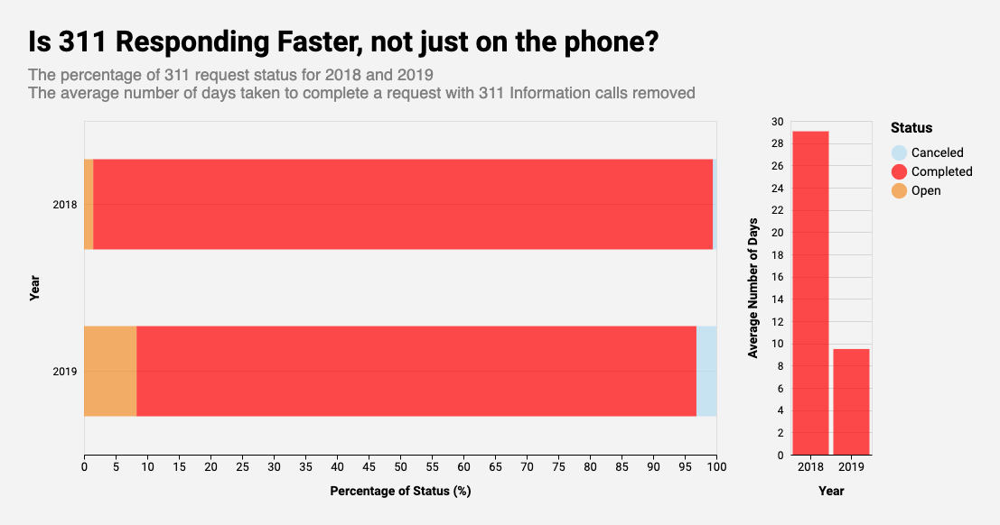

# Exploring 311 Service Requests in Chicago
## By Si Young Byun

## *Motivation*

In 1996, Baltimore deployed 3-1-1 as a dedicated telephone number for
non-emergency queries. Proving to be very popular, the 311 service was made
available to other police departments in the US. In 1999, Chicago launched the
__first comprehensive 311 service__, which not only dealt with non-emergency
police-related queries but also with other non-emergency civic service requests.
Since then, other major US cities such as Los Angeles and New York City also
adopted 311 service.

In late 2018, Chicago launched its new $35 million 311 platform [__CHI 311__](
https://311.chicago.gov/s/?language=en_US), which would allow its residents to
use their phones or computers to log and track their 311 service requests. Since
the launch of the modernized platform, [__Chicago Data Portal__](
https://data.cityofchicago.org/Service-Requests/311-Service-Requests/v6vf-nfxy) 
has been releasing the data for requests created from the new platform as well
as some historical data. 

## *Let's dive into the data!*

One simple way of visualizing the trend of 311 requests *before* and *after* the
inception of the new 311 app would be to compare the overall number of 311 
requests in 2018 and 2019, since the new system was deployed near the end of 
2018.

Source: [Chicago Data Portal - 311 Service Requests](https://data.cityofchicago.org/Service-Requests/311-Service-Requests/v6vf-nfxy)
 
The number of 311 requests in Chicago clearly increased in 2019 compared to 
2018! Of course, this does not *prove* that the new 311 app is successful. 
However, it does suggest a compelling story that the new 311 app at least 
improved the accessibility of the 311 service. It is also interesting to find 
that people are less likely to file service requests during weekends and winter 
season.

__*note*__: This chart only shows the data from July to December. This is *not* 
some malicious data manipulation but simply due to how the original dataset was 
structured. For some unspecified reason, the dataset starts from July 2018. For 
direct comparison between the two years, I decided to only show the data from 
July to December for 2019 as well.

Source: [Chicago Data Portal - 311 Service Requests](https://data.cityofchicago.org/Service-Requests/311-Service-Requests/v6vf-nfxy)

The above chart shows the percentage of 311 request status for 2018 and 2019. 
For both years, Chicago 311 service is excellent with completing their requests, 
completing over 90% of the requests. There seems to be higher percentage of 
*open* service requests in 2019. Although the exact reason behind this is 
unclear from this chart, we can speculate that this is probably because some 
requests that were made near the end of the year are still open. However, it 
is very encouraging to see that the average number of days taken to complete 
a request in 2019 dropped significantly from that of 2018. On average, it takes 
around __6 days__ to complete a request. Impressive, right?

__But wait!!!__

Source: [Chicago Data Portal - 311 Service Requests](https://data.cityofchicago.org/Service-Requests/311-Service-Requests/v6vf-nfxy)

The above chart shows the number of requests by owner department. We see the
biggest increase in __311 City Services__, which deals with 311 information only
calls. In fact, there was an increase of 350,000 requests for 311 information
only calls in just over a year! This boost isn't a bad thing because this enormous
increase again supports the idea that the new 311 app is a lot more accessible to
the people. 

However, we do have to go back to the previous chart and think again in light of
this new piece of information. What if the nice improvement in the average number of days
taken to complete a request is thanks to the increase in the number of these phone calls.
It only makes sense that these phone calls wouldn't take that long to complete.
Let's explore this possibility!

Source: [Chicago Data Portal - 311 Service Requests](https://data.cityofchicago.org/Service-Requests/311-Service-Requests/v6vf-nfxy)

Although the percentage of open requests and the average number of days to
complete a request in 2019 suffered a little, the overall trend remains unchanged.
The average number of days taken to complete a request still looks strong for 2019,
and the overwhelming majority of the 311 requests made in both 2018 and 2019 were
completed!

As we can see, even with all the 311 information calls removed, there are some 311
requests. What other departments handle 311 service requests? Let's look at how
they are doing!

Source: [Chicago Data Portal - 311 Service Requests](https://data.cityofchicago.org/Service-Requests/311-Service-Requests/v6vf-nfxy)

Since Chicago allows people to use 3-1-1 to make any non-emergency requests to
the city, the 311 service relay those requests to other departments within the city.
It looks like the department that handles animal care and control is doing a good
job of completing those requests. So is 311 City Services.
It's interesting that some people are using 311 to report a fire. Although it looks
like the 311 service is relaying those requests to Chicago Fire Department, we have to
remember that this service is for non-emergency queries (and also it takes 6 - 
10 days on average to complete a request). So the lesson here is that unless it's a fire
that can wait a week to be put out, don't use the 311 service to report a fire.

While I was researching, I learned that Chicago Fire Department uses a radio term *3-11
Alarm Response* (Source: [Chicago Fire Wire](http://www.chicagofirewire.com/chicago-fire-resources/chicago-fire-department-radio-terms-lingo/)). 
This has nothing to do with the 311 service, so don't let them fool you.

Source: [Chicago Data Portal - 311 Service Requests](https://data.cityofchicago.org/Service-Requests/311-Service-Requests/v6vf-nfxy), [Chicago Data Portal - Budget - 2019 Budget Ordinance - Appropriations](https://data.cityofchicago.org/Administration-Finance/Budget-2019-Budget-Ordinance-Appropriations/h9rt-tsn7)

The above chart shows a scatterplot of the 2019 budget and the number of 311 
service requests. It is not very surprising that there is no visual relationship 
between the budget and the number of 311 requests as different departments require
different amount of resources to address these requests. Some departments (e.g., 
Chicago Fire Department) might not even care too much about the 311 requests.

However, this chart does raise an interesting question: *what are some of the most
popular service requests in Chicago?*

Source: [Chicago Data Portal - 311 Service Requests](https://data.cityofchicago.org/Service-Requests/311-Service-Requests/v6vf-nfxy), [Chicago Data Portal - Boundaries - Census Tracts - 2010](https://data.cityofchicago.org/Facilities-Geographic-Boundaries/Boundaries-Census-Tracts-2010/5jrd-6zik)

For this question, we turn to these choropleth maps, each showing the geographical
distribution (by census tract) of some of the most popular requests in 311 services. 
With the exception of *aircraft noise complaints*, which are mostly coming near the 
airport, it looks like different parts of Chicago have different issues. For example, 
north Chicago seems to be particularly suffering from potholes whereas South Chicago 
is suffering from broken street lights and weed removal. Furthermore, the downtown 
and its surrounding area seem to have issues with graffiti.

Lastly, we will explore the relationship between income level and 311 request rate. 
I calculate 311 request rate by dividing the number of 311 requests made by the 
population size for each census tract. Although this isn't the most rigorous way 
of calculating the 311 request rate (e.g., does not have to be a resident to 
create a 311 request in that area), this would at least rule out some outliers 
where, for example, there is a high number of 311 service usage just because 
there are more people living in that area.

Source: [Chicago Data Portal - 311 Service Requests](https://data.cityofchicago.org/Service-Requests/311-Service-Requests/v6vf-nfxy), [Chicago Data Portal - Boundaries - Census Tracts - 2010](https://data.cityofchicago.org/Facilities-Geographic-Boundaries/Boundaries-Census-Tracts-2010/5jrd-6zik), [US Census Bureau Data](https://www.census.gov/)

On this bivariate choropleth map, there are a total of 9 different color on this 
map. The number of 311 service requests is represented by *x-axis* (i.e., the 
right, the more), and the average household income level is represented by the 
*y-axis* (i.e., the up, the more).

There seem to be some visual patterns on this map. First of all, there seem to 
be a clear divide in the average household income level where the north and east 
of Chicago is generally wealthier than other parts of Chicago. Furthermore, 
areas above the downtown along the river (e.g., River North, West Lakeview) seem 
to be high in both average household income level and the number of 311 requests. 

In the future, it would be interesting to dig deeper into how other socioeconomic 
factors (e.g., education level) interact with the 311 services as there seem to 
some diversity in how different areas of Chicago use 311 Service.

## *Data Sources*

1. [311 Service Requests](https://data.cityofchicago.org/Service-Requests/311-Service-Requests/v6vf-nfxy): This dataset from Chicago Data Portal includes all 311 service
requests created in Chicago after the launch of the new 311 service as well as
some requests that were created before the launch. Each row represents a service 
request. Although it has 37 columns, the variables that are of interest for the
exploration include:
    - CREATED_DATE,
    - CLOSED_DATE,
    - ZIP_CODE,
    - LONGITUDE & LATITUDE,
    - OWNER_DEPARTMENT,
    - and SR_TYPE. 

2. [US Census Bureau Data](https://www.census.gov/):
From this dataset (American Community Survey 2018 5-Year Estimates),
I was able to get income level and population size for census tracts in Chicago.

3. [Boundaries - Census Tracts - 2010](https://data.cityofchicago.org/Facilities-Geographic-Boundaries/Boundaries-Census-Tracts-2010/5jrd-6zik):
For this portfolio, I used the shapefile of census tracts to join US Census
Bureau data and 311 Service Requests data.

4. [Budget - 2019 Budget Ordinance - Appropriations](https://data.cityofchicago.org/Administration-Finance/Budget-2019-Budget-Ordinance-Appropriations/h9rt-tsn7):
This dataset from Chicago Data Portal includes the final City operating budget as approved by the City Council.

5. [Datasets created by above datasets](https://github.com/siyoungbyun/311-requests-dataviz/tree/master/data): If you are interested in how I preprocessed the data, please visit [this Jupyter Notebook](https://github.com/siyoungbyun/311-requests-dataviz/blob/master/data_preprocessing.ipynb).

6. [Code for data visualization](https://github.com/siyoungbyun/311-requests-dataviz/blob/master/311_service_requests_portfolio.ipynb): For all data visualization used in this article, you can find the code [here](https://github.com/siyoungbyun/311-requests-dataviz/blob/master/311_service_requests_portfolio.ipynb). Please feel free to replicate and extend these results! I used the following tools to create charts:
    - [Python 3.7: Programming Language](https://www.python.org/)
    - [Altair: Declarative Visualization in Python](https://altair-viz.github.io/)
    - [Geopandas](https://geopandas.org/)
    - [pandas](https://pandas.pydata.org/)

